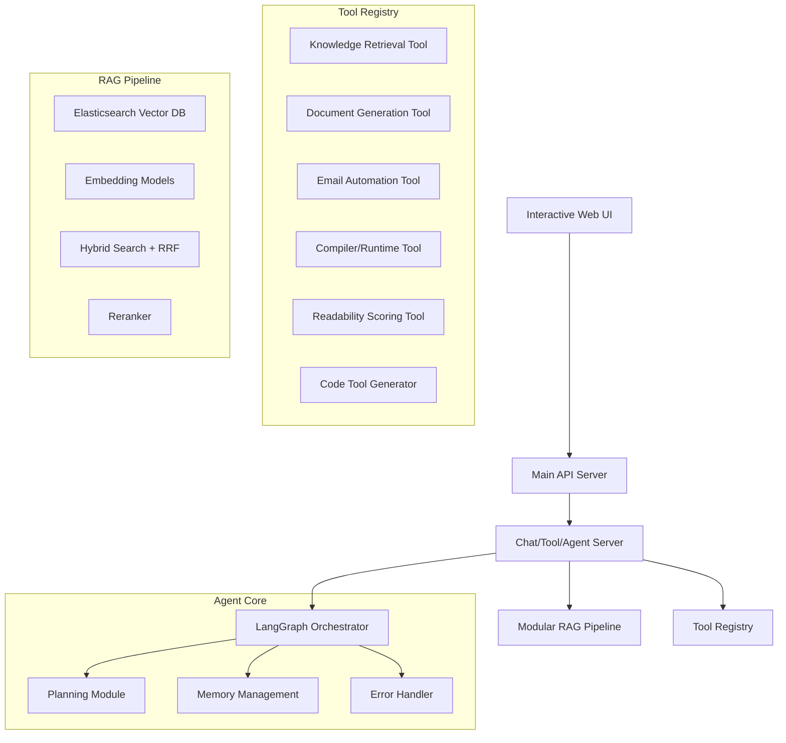
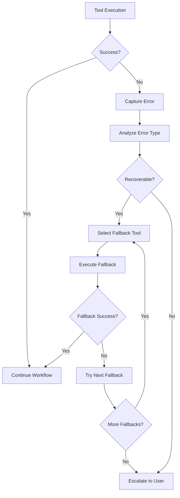

# Architecture Design Document

## Overview

The Software Engineering Subject Matter Expert (SE SME) Agent is designed as a sophisticated, multi-component system that combines advanced Retrieval-Augmented Generation (RAG) capabilities with agentic workflows and comprehensive tool integration. The system architecture prioritizes modularity, scalability, and robustness while maintaining dual optimization targets for both technical accuracy and pedagogical clarity.

The design implements a three-tier architecture consisting of a Main API Server, Chat/Tool/Agent Server, and Modular RAG Pipeline, orchestrated through stateful workflows that enable complex multi-step reasoning and tool chaining capabilities.

## Architecture

### High-Level System Architecture



### Component Architecture Details

#### 1. Main API Server (FastAPI)
- **Purpose**: Gateway for all external requests with robust validation and security
- **Technology**: FastAPI with async support, Redis for caching, PostgreSQL for session storage
- **Architecture**:
  ```
  ┌─────────────────┐    ┌──────────────┐    ┌─────────────────┐
  │   Load Balancer │────│  API Gateway │────│  Rate Limiter   │
  └─────────────────┘    └──────────────┘    └─────────────────┘
           │                       │                    │
           ▼                       ▼                    ▼
  ┌─────────────────┐    ┌──────────────┐    ┌─────────────────┐
  │ Input Validator │    │ Auth Service │    │ Output Filter   │
  └─────────────────┘    └──────────────┘    └─────────────────┘
  ```
- **Detailed Components**:
  - **Request Router**: Intelligent routing based on request type and user context
  - **Input Sanitizer**: Multi-layer validation including regex patterns, ML-based injection detection
  - **Authentication Manager**: JWT-based auth with role-based access control
  - **Rate Limiter**: Token bucket algorithm with user-specific and global limits
  - **Response Formatter**: Standardized API response formatting with error codes
  - **WebSocket Manager**: Real-time bidirectional communication for UI updates
  - **Health Monitor**: Endpoint health checks and system status reporting
  - **Metrics Collector**: Request/response metrics, latency tracking, error rates

#### 2. Chat/Tool/Agent Server
- **Purpose**: Core orchestration engine managing conversations and tool execution
- **Technology**: LangGraph for stateful workflow management, Redis for state persistence
- **Architecture**:
  ```
  ┌─────────────────┐    ┌──────────────┐    ┌─────────────────┐
  │ Query Processor │────│ Task Planner │────│ Tool Orchestrator│
  └─────────────────┘    └──────────────┘    └─────────────────┘
           │                       │                    │
           ▼                       ▼                    ▼
  ┌─────────────────┐    ┌──────────────┐    ┌─────────────────┐
  │ Context Manager │    │ State Engine │    │ Error Handler   │
  └─────────────────┘    └──────────────┘    └─────────────────┘
  ```
- **Detailed Components**:
  - **Query Processor**: NLP preprocessing, intent classification, entity extraction
  - **Task Planner**: Hierarchical task decomposition using ReAct framework
  - **Tool Orchestrator**: Dynamic tool selection, execution scheduling, result aggregation
  - **Context Manager**: Conversation history, user preferences, session state
  - **State Engine**: LangGraph-based state machine for complex workflows
  - **Memory Manager**: Short-term (conversation) and long-term (user profile) memory
  - **Reasoning Engine**: Multi-step reasoning with reflection and self-correction
  - **Execution Monitor**: Real-time tracking of task progress and resource usage

#### 3. Modular RAG Pipeline
- **Purpose**: Specialized retrieval system optimized for software engineering content
- **Technology**: Elasticsearch with custom hybrid search, sentence-transformers, BGE reranker
- **Architecture**:
  ```
  ┌─────────────────┐    ┌──────────────┐    ┌─────────────────┐
  │ Document Loader │────│ Chunk Processor│────│ Embedding Engine│
  └─────────────────┘    └──────────────┘    └─────────────────┘
           │                       │                    │
           ▼                       ▼                    ▼
  ┌─────────────────┐    ┌──────────────┐    ┌─────────────────┐
  │ Vector Store    │────│ Hybrid Search │────│ Reranker        │
  └─────────────────┘    └──────────────┘    └─────────────────┘
  ```
- **Detailed Components**:
  - **Document Loader**: Multi-format parser (PDF, DOCX, PPTX, MD, TXT) with metadata extraction
  - **Chunk Processor**: Content-aware chunking with hierarchical relationships
  - **Embedding Engine**: Dual model system (all-mpnet-base-v2 + GraphCodeBERT)
  - **Vector Store**: Elasticsearch with dense vector indexing and sparse keyword indexing
  - **Hybrid Search**: Combined vector similarity + BM25 with RRF score fusion
  - **Reranker**: BGE cross-encoder for final relevance scoring
  - **Index Manager**: Automated index optimization, backup, and recovery
  - **Quality Assessor**: Retrieval quality monitoring and performance tuning

#### 4. Interactive Web UI
- **Purpose**: Comprehensive user interface for all system features
- **Technology**: React.js with TypeScript, Material-UI, WebSocket integration, PWA support
- **Architecture**:
  ```
  ┌─────────────────┐    ┌──────────────┐    ┌─────────────────┐
  │ Chat Interface  │────│ Feature Hub  │────│ Admin Dashboard │
  └─────────────────┘    └──────────────┘    └─────────────────┘
           │                       │                    │
           ▼                       ▼                    ▼
  ┌─────────────────┐    ┌──────────────┐    ┌─────────────────┐
  │ State Manager   │────│ API Client   │────│ Notification Sys│
  └─────────────────┘    └──────────────┘    └─────────────────┘
  ```
- **Detailed Components**:
  - **Chat Interface**: Real-time messaging with markdown rendering, code highlighting
  - **Feature Hub**: Organized access to document generation, code tools, educational content
  - **Admin Dashboard**: System monitoring, user management, performance analytics
  - **State Manager**: Redux-based state management with persistence
  - **API Client**: Axios-based HTTP client with retry logic and error handling
  - **Notification System**: Toast notifications, progress indicators, status updates
  - **File Manager**: Upload/download interface with drag-drop support
  - **Settings Panel**: User preferences, system configuration, accessibility options

#### 5. Tool Registry and Management System
- **Purpose**: Dynamic tool registration, discovery, and lifecycle management
- **Technology**: Plugin architecture with hot-swapping capabilities
- **Architecture**:
  ```
  ┌─────────────────┐    ┌──────────────┐    ┌─────────────────┐
  │ Tool Registry   │────│ Tool Factory │────│ Tool Validator  │
  └─────────────────┘    └──────────────┘    └─────────────────┘
           │                       │                    │
           ▼                       ▼                    ▼
  ┌─────────────────┐    ┌──────────────┐    ┌─────────────────┐
  │ Execution Pool  │────│ Result Cache │────│ Performance Mon │
  └─────────────────┘    └──────────────┘    └─────────────────┘
  ```
- **Detailed Components**:
  - **Tool Registry**: Central repository of available tools with metadata and schemas
  - **Tool Factory**: Dynamic tool instantiation and configuration management
  - **Tool Validator**: Schema validation, security checks, performance testing
  - **Execution Pool**: Concurrent tool execution with resource management
  - **Result Cache**: Intelligent caching of tool results with TTL and invalidation
  - **Performance Monitor**: Tool execution metrics, success rates, latency tracking
  - **Dependency Manager**: Tool dependency resolution and version management
  - **Security Scanner**: Automated security analysis of tool code and permissions

#### 6. Data Management Layer
- **Purpose**: Comprehensive data storage, processing, and lifecycle management
- **Technology**: PostgreSQL for structured data, Elasticsearch for search, Redis for caching
- **Architecture**:
  ```
  ┌─────────────────┐    ┌──────────────┐    ┌─────────────────┐
  │ Data Ingestion  │────│ Data Pipeline│────│ Data Storage    │
  └─────────────────┘    └──────────────┘    └─────────────────┘
           │                       │                    │
           ▼                       ▼                    ▼
  ┌─────────────────┐    ┌──────────────┐    ┌─────────────────┐
  │ Data Validation │────│ Data Transform│────│ Data Retrieval  │
  └─────────────────┘    └──────────────┘    └─────────────────┘
  ```
- **Detailed Components**:
  - **Data Ingestion**: Batch and streaming data ingestion with format detection
  - **Data Pipeline**: ETL processes for document processing and embedding generation
  - **Data Storage**: Multi-tier storage strategy (hot/warm/cold data)
  - **Data Validation**: Schema validation, quality checks, duplicate detection
  - **Data Transform**: Content preprocessing, chunking, metadata enrichment
  - **Data Retrieval**: Optimized query processing with caching and indexing
  - **Backup Manager**: Automated backup and disaster recovery procedures
  - **Data Governance**: Access control, audit logging, compliance monitoring

#### 7. Monitoring and Observability System
- **Purpose**: Comprehensive system monitoring, logging, and performance analysis
- **Technology**: Prometheus for metrics, ELK stack for logging, Grafana for visualization
- **Architecture**:
  ```
  ┌─────────────────┐    ┌──────────────┐    ┌─────────────────┐
  │ Metrics Collector│────│ Log Aggregator│────│ Alert Manager   │
  └─────────────────┘    └──────────────┘    └─────────────────┘
           │                       │                    │
           ▼                       ▼                    ▼
  ┌─────────────────┐    ┌──────────────┐    ┌─────────────────┐
  │ Dashboard       │────│ Analytics    │────│ Report Generator│
  └─────────────────┘    └──────────────┘    └─────────────────┘
  ```
- **Detailed Components**:
  - **Metrics Collector**: System metrics, application metrics, business metrics
  - **Log Aggregator**: Centralized logging with structured log format
  - **Alert Manager**: Intelligent alerting with escalation policies
  - **Dashboard**: Real-time system visualization and health monitoring
  - **Analytics**: Performance analysis, usage patterns, trend identification
  - **Report Generator**: Automated reporting for stakeholders and compliance
  - **Trace Collector**: Distributed tracing for request flow analysis
  - **Anomaly Detector**: ML-based anomaly detection for proactive monitoring

## Components and Interfaces

### Core Agent Components

#### Planning Module
```python
class PlanningModule:
    def __init__(self, config: PlanningConfig):
        self.config = config
        self.reasoning_engine = ReasoningEngine()
        self.task_decomposer = TaskDecomposer()
        self.tool_selector = ToolSelector()
        self.execution_planner = ExecutionPlanner()
        self.adaptation_engine = AdaptationEngine()
        self.plan_validator = PlanValidator()
        
    def create_comprehensive_plan(self, user_query: str, context: ConversationContext) -> ComprehensivePlan:
        """Create a complete execution plan with multiple strategies and fallbacks"""
        # 1. Query analysis and intent classification
        query_analysis = self._analyze_query_complexity(user_query, context)
        
        # 2. Multi-level task decomposition
        primary_plan = self._create_primary_plan(query_analysis)
        fallback_plans = self._create_fallback_plans(query_analysis)
        
        # 3. Resource estimation and constraint analysis
        resource_requirements = self._estimate_resource_requirements(primary_plan)
        constraints = self._analyze_constraints(resource_requirements, context)
        
        # 4. Plan validation and optimization
        validated_plan = self.plan_validator.validate_and_optimize(
            primary_plan, fallback_plans, constraints
        )
        
        return ComprehensivePlan(
            primary_plan=validated_plan.primary,
            fallback_plans=validated_plan.fallbacks,
            resource_requirements=resource_requirements,
            estimated_duration=validated_plan.duration,
            confidence_score=validated_plan.confidence
        )
        
    def decompose_request(self, user_query: str, context: ConversationContext) -> TaskDecomposition:
        """Advanced task decomposition with hierarchical planning"""
        # 1. Semantic analysis and entity extraction
        semantic_analysis = self.reasoning_engine.analyze_semantics(user_query)
        entities = self.reasoning_engine.extract_entities(user_query, context)
        
        # 2. Goal identification and prioritization
        goals = self._identify_goals(semantic_analysis, entities)
        prioritized_goals = self._prioritize_goals(goals, context.user_preferences)
        
        # 3. Hierarchical task breakdown
        task_hierarchy = self.task_decomposer.create_hierarchy(prioritized_goals)
        
        # 4. Dependency analysis and sequencing
        dependencies = self._analyze_task_dependencies(task_hierarchy)
        execution_sequence = self._determine_execution_sequence(task_hierarchy, dependencies)
        
        return TaskDecomposition(
            goals=prioritized_goals,
            task_hierarchy=task_hierarchy,
            dependencies=dependencies,
            execution_sequence=execution_sequence,
            parallel_opportunities=self._identify_parallel_execution_opportunities(execution_sequence)
        )
        
    def select_tools(self, subtask: SubTask, available_tools: List[Tool], 
                    context: ExecutionContext) -> ToolSelectionResult:
        """Intelligent tool selection with multi-criteria optimization"""
        # 1. Tool capability matching
        capable_tools = self.tool_selector.filter_by_capability(available_tools, subtask.requirements)
        
        # 2. Multi-criteria evaluation
        evaluation_criteria = {
            'accuracy': 0.3,
            'speed': 0.2,
            'reliability': 0.25,
            'resource_efficiency': 0.15,
            'user_preference': 0.1
        }
        
        tool_scores = {}
        for tool in capable_tools:
            scores = self.tool_selector.evaluate_tool(tool, subtask, context, evaluation_criteria)
            tool_scores[tool.id] = scores
            
        # 3. Tool selection with fallback options
        primary_tool = self._select_primary_tool(tool_scores)
        fallback_tools = self._select_fallback_tools(tool_scores, primary_tool)
        
        # 4. Tool configuration optimization
        optimized_config = self.tool_selector.optimize_configuration(
            primary_tool, subtask, context
        )
        
        return ToolSelectionResult(
            primary_tool=primary_tool,
            fallback_tools=fallback_tools,
            configuration=optimized_config,
            confidence_score=tool_scores[primary_tool.id].overall_score,
            selection_rationale=self._generate_selection_rationale(tool_scores, primary_tool)
        )
        
    def create_execution_graph(self, task_decomposition: TaskDecomposition, 
                              tool_selections: Dict[str, ToolSelectionResult]) -> ExecutionGraph:
        """Create sophisticated execution graph with conditional flows and error handling"""
        # 1. Graph structure creation
        graph = ExecutionGraph()
        
        # 2. Node creation with state management
        for task in task_decomposition.execution_sequence:
            node = self._create_execution_node(task, tool_selections[task.id])
            graph.add_node(node)
            
        # 3. Edge creation with conditional logic
        for dependency in task_decomposition.dependencies:
            edge = self._create_conditional_edge(dependency, tool_selections)
            graph.add_edge(edge)
            
        # 4. Error handling and recovery paths
        self._add_error_handling_paths(graph, tool_selections)
        
        # 5. Parallel execution optimization
        self._optimize_parallel_execution(graph, task_decomposition.parallel_opportunities)
        
        # 6. Resource allocation and scheduling
        self._allocate_resources(graph, task_decomposition)
        
        return graph
        
    def adapt_plan(self, current_plan: ExecutionGraph, feedback: Observation, 
                  execution_state: ExecutionState) -> AdaptationResult:
        """Dynamic plan adaptation based on execution feedback"""
        # 1. Feedback analysis and impact assessment
        feedback_analysis = self.adaptation_engine.analyze_feedback(feedback, execution_state)
        impact_assessment = self.adaptation_engine.assess_impact(feedback_analysis, current_plan)
        
        # 2. Adaptation strategy selection
        if impact_assessment.severity == 'low':
            adaptation = self._minor_adaptation(current_plan, feedback_analysis)
        elif impact_assessment.severity == 'medium':
            adaptation = self._moderate_adaptation(current_plan, feedback_analysis)
        else:
            adaptation = self._major_replanning(current_plan, feedback_analysis, execution_state)
            
        # 3. Plan validation and risk assessment
        validation_result = self.plan_validator.validate_adaptation(adaptation, execution_state)
        
        # 4. Rollback strategy preparation
        rollback_strategy = self._prepare_rollback_strategy(current_plan, adaptation)
        
        return AdaptationResult(
            adapted_plan=adaptation.plan,
            adaptation_type=adaptation.type,
            confidence_score=validation_result.confidence,
            rollback_strategy=rollback_strategy,
            execution_instructions=adaptation.instructions
        )
        
    def monitor_execution_progress(self, execution_graph: ExecutionGraph, 
                                 current_state: ExecutionState) -> ProgressMonitoring:
        """Comprehensive execution progress monitoring with predictive analysis"""
        # 1. Progress calculation and milestone tracking
        progress_metrics = self._calculate_progress_metrics(execution_graph, current_state)
        milestone_status = self._check_milestone_status(execution_graph, current_state)
        
        # 2. Performance analysis and bottleneck detection
        performance_analysis = self._analyze_execution_performance(execution_graph, current_state)
        bottlenecks = self._detect_bottlenecks(performance_analysis)
        
        # 3. Predictive analysis and ETA calculation
        eta_prediction = self._predict_completion_time(execution_graph, current_state, performance_analysis)
        risk_assessment = self._assess_execution_risks(execution_graph, current_state)
        
        # 4. Optimization recommendations
        optimization_suggestions = self._generate_optimization_suggestions(
            bottlenecks, performance_analysis, risk_assessment
        )
        
        return ProgressMonitoring(
            progress_percentage=progress_metrics.percentage,
            completed_tasks=progress_metrics.completed_count,
            remaining_tasks=progress_metrics.remaining_count,
            milestone_status=milestone_status,
            estimated_completion=eta_prediction,
            performance_metrics=performance_analysis,
            bottlenecks=bottlenecks,
            risk_level=risk_assessment.level,
            optimization_suggestions=optimization_suggestions
        )
        
    def _analyze_query_complexity(self, query: str, context: ConversationContext) -> QueryAnalysis:
        """Analyze query complexity and determine planning strategy"""
        
    def _create_primary_plan(self, query_analysis: QueryAnalysis) -> ExecutionPlan:
        """Create the primary execution plan"""
        
    def _create_fallback_plans(self, query_analysis: QueryAnalysis) -> List[ExecutionPlan]:
        """Create alternative execution plans for error recovery"""
        
    def _estimate_resource_requirements(self, plan: ExecutionPlan) -> ResourceRequirements:
        """Estimate computational and time resources needed"""
        
    def _identify_goals(self, semantic_analysis: SemanticAnalysis, 
                       entities: List[Entity]) -> List[Goal]:
        """Identify and structure user goals from query analysis"""
        
    def _analyze_task_dependencies(self, task_hierarchy: TaskHierarchy) -> DependencyGraph:
        """Analyze dependencies between tasks"""
        
    def _create_execution_node(self, task: SubTask, 
                              tool_selection: ToolSelectionResult) -> ExecutionNode:
        """Create execution node with state management and error handling"""
        
    def _add_error_handling_paths(self, graph: ExecutionGraph, 
                                 tool_selections: Dict[str, ToolSelectionResult]):
        """Add comprehensive error handling and recovery paths to execution graph"""
```

#### Memory Management
```python
class MemoryManager:
    def store_conversation(self, session_id: str, message: Message)
    def retrieve_context(self, session_id: str, window_size: int) -> Context
    def update_user_preferences(self, user_id: str, preferences: Dict)
    def maintain_tool_state(self, tool_id: str, state: ToolState)
```

#### Error Handler
```python
class ErrorHandler:
    def capture_tool_error(self, tool_id: str, error: Exception) -> Observation
    def determine_fallback(self, error: Observation) -> FallbackAction
    def execute_recovery(self, fallback: FallbackAction) -> RecoveryResult
    def log_failure_patterns(self, error_chain: List[Observation])
```

### RAG Pipeline Components

#### Document Processor
```python
class DocumentProcessor:
    def detect_format(self, file_path: str) -> DocumentType
    def extract_content(self, document: Document) -> ExtractedContent
    def apply_chunking_strategy(self, content: ExtractedContent) -> List[Chunk]
    def generate_metadata(self, document: Document) -> Metadata
```

#### Hybrid Search Engine
```python
class HybridSearchEngine:
    def vector_search(self, query_embedding: np.ndarray, k: int) -> List[VectorResult]
    def keyword_search(self, query: str, k: int) -> List[KeywordResult]
    def fuse_results(self, vector_results: List, keyword_results: List) -> List[FusedResult]
    def rerank_results(self, results: List[FusedResult], query: str) -> List[RankedResult]
```

#### Embedding Manager
```python
class EmbeddingManager:
    def load_models(self) -> Tuple[GeneralModel, DomainModel]
    def generate_embeddings(self, text: str, model_type: str) -> np.ndarray
    def compare_model_performance(self, query: str, ground_truth: List) -> ComparisonResult
    def update_model_selection(self, performance_data: ComparisonResult)
```

### Tool Integration Framework

#### Base Tool Interface
```python
class BaseTool:
    def __init__(self, config: ToolConfig):
        self.config = config
        self.metrics = ToolMetrics()
        self.cache = ToolCache()
        
    def validate_input(self, input_data: Dict) -> ValidationResult:
        """Comprehensive input validation with schema checking"""
        
    def execute(self, input_data: Dict) -> ToolResult:
        """Main execution logic with monitoring and caching"""
        
    def handle_error(self, error: Exception) -> ErrorResult:
        """Structured error handling with recovery suggestions"""
        
    def get_schema(self) -> ToolSchema:
        """Return tool schema for dynamic discovery"""
        
    def get_performance_metrics(self) -> PerformanceMetrics:
        """Return execution performance data"""
        
    def cleanup_resources(self):
        """Resource cleanup and connection management"""
```

#### Knowledge Retrieval Tool
```python
class KnowledgeRetrievalTool(BaseTool):
    def __init__(self, config: ToolConfig):
        super().__init__(config)
        self.hybrid_search = HybridSearchEngine()
        self.reranker = BGEReranker()
        self.scope_detector = ScopeDetector()
        
    def search_knowledge_base(self, query: str, filters: Dict) -> RetrievalResult:
        """Multi-stage retrieval with scope validation"""
        # 1. Scope detection and validation
        scope_result = self.scope_detector.classify_query_domain(query)
        if not scope_result.is_in_scope:
            return self._generate_out_of_scope_response(query, scope_result)
            
        # 2. Hybrid search execution
        vector_results = self.hybrid_search.vector_search(query, k=50)
        keyword_results = self.hybrid_search.keyword_search(query, k=50)
        
        # 3. Score fusion and reranking
        fused_results = self.hybrid_search.fuse_results(vector_results, keyword_results)
        reranked_results = self.reranker.rerank(fused_results, query, top_k=10)
        
        # 4. Context assembly and validation
        context = self._assemble_hierarchical_context(reranked_results)
        return RetrievalResult(context=context, confidence=scope_result.confidence)
        
    def assess_relevance_score(self, results: List) -> float:
        """Calculate aggregate relevance score for quality monitoring"""
        
    def format_context(self, results: List) -> FormattedContext:
        """Format retrieved context with citations and metadata"""
        
    def _assemble_hierarchical_context(self, results: List) -> HierarchicalContext:
        """Assemble parent-child context relationships"""
        
    def _generate_out_of_scope_response(self, query: str, scope_result: ScopeResult) -> RetrievalResult:
        """Generate appropriate out-of-scope response"""
```

#### Document Generation Tool
```python
class DocumentGenerationTool(BaseTool):
    def __init__(self, config: ToolConfig):
        super().__init__(config)
        self.template_manager = TemplateManager()
        self.format_validators = {
            'docx': DocxValidator(),
            'pdf': PdfValidator(),
            'ppt': PptValidator()
        }
        
    def generate_docx(self, content: str, template: str = "default") -> DocxResult:
        """Generate DOCX with template support and validation"""
        try:
            template_obj = self.template_manager.load_template(template, 'docx')
            processor = DocxProcessor(template_obj)
            
            # Content preprocessing and structure analysis
            structured_content = self._analyze_content_structure(content)
            
            # Document generation with formatting
            document = processor.generate_document(structured_content)
            
            # Validation and quality checks
            validation_result = self.format_validators['docx'].validate(document)
            if not validation_result.is_valid:
                raise DocumentGenerationError(validation_result.errors)
                
            return DocxResult(document=document, metadata=validation_result.metadata)
            
        except Exception as e:
            return self._handle_generation_error(e, 'docx', content, template)
            
    def generate_pdf(self, content: str, template: str = "default") -> PdfResult:
        """Generate PDF with advanced formatting and accessibility"""
        
    def generate_ppt(self, content: str, template: str = "default") -> PptResult:
        """Generate PowerPoint with slide structure optimization"""
        
    def validate_output(self, document: Document) -> ValidationResult:
        """Comprehensive document validation including accessibility"""
        
    def _analyze_content_structure(self, content: str) -> StructuredContent:
        """Analyze content structure for optimal document formatting"""
        
    def _handle_generation_error(self, error: Exception, format_type: str, 
                                content: str, template: str) -> ErrorResult:
        """Intelligent error handling with fallback suggestions"""
```

#### Code Tool Generator
```python
class CodeToolGenerator(BaseTool):
    def __init__(self, config: ToolConfig):
        super().__init__(config)
        self.code_analyzer = CodeAnalyzer()
        self.test_generator = TestGenerator()
        self.security_scanner = SecurityScanner()
        self.tool_registry = ToolRegistry()
        
    def analyze_requirements(self, description: str) -> ToolRequirements:
        """Analyze natural language description to extract tool requirements"""
        # 1. Intent classification and parameter extraction
        intent = self._classify_tool_intent(description)
        parameters = self._extract_parameters(description)
        
        # 2. Dependency analysis and compatibility checking
        dependencies = self._analyze_dependencies(intent, parameters)
        
        # 3. Security and safety assessment
        security_assessment = self._assess_security_requirements(intent, parameters)
        
        return ToolRequirements(
            intent=intent,
            parameters=parameters,
            dependencies=dependencies,
            security_level=security_assessment.level,
            estimated_complexity=self._estimate_complexity(intent, parameters)
        )
        
    def generate_tool_code(self, requirements: ToolRequirements) -> GeneratedCode:
        """Generate complete tool code with error handling and documentation"""
        # 1. Code template selection and customization
        template = self._select_code_template(requirements.intent)
        
        # 2. Code generation with LLM
        generated_code = self._generate_code_with_llm(requirements, template)
        
        # 3. Code analysis and optimization
        analyzed_code = self.code_analyzer.analyze(generated_code)
        optimized_code = self._optimize_code(analyzed_code)
        
        # 4. Documentation generation
        documentation = self._generate_documentation(optimized_code, requirements)
        
        return GeneratedCode(
            code=optimized_code,
            documentation=documentation,
            dependencies=requirements.dependencies,
            test_cases=self.test_generator.generate_tests(optimized_code)
        )
        
    def test_generated_tool(self, code: GeneratedCode) -> TestResult:
        """Comprehensive testing of generated tool code"""
        # 1. Static analysis and security scanning
        static_analysis = self.code_analyzer.static_analysis(code.code)
        security_scan = self.security_scanner.scan(code.code)
        
        # 2. Unit test execution
        unit_test_results = self._execute_unit_tests(code.test_cases)
        
        # 3. Integration testing with existing tools
        integration_results = self._test_tool_integration(code)
        
        # 4. Performance benchmarking
        performance_metrics = self._benchmark_performance(code)
        
        return TestResult(
            static_analysis=static_analysis,
            security_scan=security_scan,
            unit_tests=unit_test_results,
            integration_tests=integration_results,
            performance=performance_metrics,
            overall_score=self._calculate_overall_score([
                static_analysis, security_scan, unit_test_results, 
                integration_results, performance_metrics
            ])
        )
        
    def register_tool(self, validated_tool: ValidatedTool) -> RegistrationResult:
        """Register validated tool in the system registry"""
        
    def _classify_tool_intent(self, description: str) -> ToolIntent:
        """Classify the intended functionality of the tool"""
        
    def _generate_code_with_llm(self, requirements: ToolRequirements, 
                               template: CodeTemplate) -> str:
        """Use LLM to generate tool code based on requirements"""
```

#### Email Automation Tool
```python
class EmailAutomationTool(BaseTool):
    def __init__(self, config: ToolConfig):
        super().__init__(config)
        self.smtp_manager = SMTPManager()
        self.template_engine = EmailTemplateEngine()
        self.attachment_processor = AttachmentProcessor()
        
    def send_email(self, recipient: str, subject: str, content: str, 
                  attachments: List[Attachment] = None) -> EmailResult:
        """Send email with comprehensive error handling and delivery tracking"""
        
    def send_document(self, recipient: str, document: Document, 
                     message: str = None) -> EmailResult:
        """Send generated document via email with appropriate formatting"""
        
    def validate_email_address(self, email: str) -> ValidationResult:
        """Validate email address format and deliverability"""
        
    def track_delivery_status(self, email_id: str) -> DeliveryStatus:
        """Track email delivery status and handle bounces"""
```

#### Compiler/Runtime Tool
```python
class CompilerRuntimeTool(BaseTool):
    def __init__(self, config: ToolConfig):
        super().__init__(config)
        self.language_handlers = {
            'python': PythonHandler(),
            'java': JavaHandler(),
            'javascript': JavaScriptHandler(),
            'cpp': CppHandler()
        }
        self.sandbox_manager = SandboxManager()
        
    def compile_and_execute(self, code: str, language: str, 
                           test_cases: List[TestCase]) -> ExecutionResult:
        """Compile and execute code with comprehensive testing"""
        
    def calculate_pass_at_k(self, code_samples: List[str], test_cases: List[TestCase], 
                           k_values: List[int] = [1, 3, 5]) -> PassAtKResult:
        """Calculate Pass@k metrics for code generation evaluation"""
        
    def validate_code_syntax(self, code: str, language: str) -> SyntaxValidationResult:
        """Validate code syntax without execution"""
        
    def analyze_code_quality(self, code: str, language: str) -> CodeQualityResult:
        """Analyze code quality metrics and best practices compliance"""
```

#### Readability Scoring Tool
```python
class ReadabilityScoringTool(BaseTool):
    def __init__(self, config: ToolConfig):
        super().__init__(config)
        self.flesch_calculator = FleschCalculator()
        self.complexity_analyzer = ComplexityAnalyzer()
        
    def calculate_readability_scores(self, text: str) -> ReadabilityScores:
        """Calculate comprehensive readability metrics"""
        
    def assess_educational_suitability(self, text: str, 
                                     target_grade: int) -> SuitabilityAssessment:
        """Assess text suitability for educational purposes"""
        
    def suggest_simplifications(self, text: str, 
                              target_score: float) -> SimplificationSuggestions:
        """Suggest text modifications to achieve target readability"""
        
    def validate_pedagogical_quality(self, content: str, 
                                   content_type: str) -> PedagogicalQuality:
        """Validate content quality for educational use"""
```

### Scope Detection and Hallucination Prevention

#### Scope Detector
```python
class ScopeDetector:
    def classify_query_domain(self, query: str) -> DomainClassification
    def calculate_confidence_score(self, classification: DomainClassification) -> float
    def generate_out_of_scope_response(self, query: str) -> Response
```

#### Hallucination Preventer
```python
class HallucinationPreventer:
    def validate_against_sources(self, response: str, sources: List) -> ValidationScore
    def detect_uncertainty_markers(self, response: str) -> UncertaintyLevel
    def enforce_citation_requirements(self, response: str) -> CitationResult
    def flag_potential_hallucination(self, response: str) -> HallucinationFlag
```

## Data Models

### Core Data Structures

#### Document Model
```python
@dataclass
class Document:
    id: str
    title: str
    content: str
    format: DocumentType
    metadata: Metadata
    chunks: List[Chunk]
    embedding_vectors: Dict[str, np.ndarray]
    created_at: datetime
    updated_at: datetime
```

#### Chunk Model
```python
@dataclass
class Chunk:
    id: str
    document_id: str
    content: str
    token_count: int
    granularity: ChunkGranularity  # 128, 512, 2048
    parent_chunk_id: Optional[str]
    child_chunk_ids: List[str]
    embedding_vector: np.ndarray
    metadata: ChunkMetadata
```

#### Conversation Model
```python
@dataclass
class Conversation:
    session_id: str
    user_id: str
    messages: List[Message]
    context: ConversationContext
    tool_states: Dict[str, ToolState]
    preferences: UserPreferences
    created_at: datetime
    last_activity: datetime
```

#### Task Execution Model
```python
@dataclass
class TaskExecution:
    execution_id: str
    session_id: str
    original_query: str
    subtasks: List[SubTask]
    execution_graph: ExecutionGraph
    current_state: ExecutionState
    tool_results: List[ToolResult]
    errors: List[ErrorObservation]
    final_result: Optional[FinalResult]
```

### Evaluation Data Models

#### Performance Metrics
```python
@dataclass
class PerformanceMetrics:
    pass_at_k: Dict[int, float]  # k=1,3,5
    flesch_reading_ease: float
    flesch_kincaid_grade: float
    retrieval_ndcg: float
    retrieval_hit_rate: float
    rrf_effectiveness: float
    hallucination_rate: float
    scope_detection_accuracy: float
```

#### Evaluation Result
```python
@dataclass
class EvaluationResult:
    test_case_id: str
    query: str
    expected_output: str
    actual_output: str
    metrics: PerformanceMetrics
    execution_trace: List[ExecutionStep]
    error_analysis: Optional[ErrorAnalysis]
    timestamp: datetime
```

## Error Handling

### Multi-Level Error Handling Strategy

#### 1. Tool-Level Error Handling
- **Immediate Recovery**: Each tool implements internal error handling with automatic retries
- **Graceful Degradation**: Tools provide alternative outputs when primary functionality fails
- **Error Propagation**: Structured error information passed to orchestration layer

#### 2. Orchestration-Level Error Handling
- **Multi-Call Recovery**: Automatic fallback to alternative tools (DOCX → PDF → TXT)
- **State Preservation**: Maintain execution state during error recovery
- **Intelligent Retry**: LLM-guided retry strategies based on error analysis

#### 3. System-Level Error Handling
- **Circuit Breakers**: Prevent cascade failures in external service dependencies
- **Health Monitoring**: Continuous monitoring of component health and performance
- **Fallback Modes**: Degraded functionality when critical components are unavailable

### Error Recovery Workflows



## Testing Strategy

### Comprehensive Testing Framework

#### 1. Unit Testing
- **Component Isolation**: Test individual components in isolation
- **Mock Dependencies**: Use mocks for external services and databases
- **Edge Case Coverage**: Comprehensive testing of boundary conditions
- **Performance Benchmarks**: Establish performance baselines for critical components

#### 2. Integration Testing
- **Tool Chain Testing**: Validate multi-tool workflows end-to-end
- **RAG Pipeline Testing**: Test retrieval accuracy and relevance
- **Error Recovery Testing**: Validate fallback mechanisms under failure conditions
- **API Contract Testing**: Ensure API compatibility across component updates

#### 3. System Testing
- **Load Testing**: Validate system performance under concurrent user load
- **Stress Testing**: Test system behavior at resource limits
- **Security Testing**: Validate input sanitization and output moderation
- **Usability Testing**: Evaluate user interface effectiveness and accessibility

#### 4. Evaluation Testing
- **Pass@k Validation**: Automated code generation accuracy testing
- **Readability Assessment**: Automated evaluation of educational content quality
- **Retrieval Quality**: Systematic evaluation of RAG pipeline effectiveness
- **Hallucination Detection**: Automated detection of factual inaccuracies

### Test Data Management

#### Synthetic Test Generation
```python
class TestDataGenerator:
    def generate_code_problems(self, difficulty: str, count: int) -> List[CodeProblem]
    def create_educational_scenarios(self, grade_level: str) -> List[EducationScenario]
    def synthesize_technical_queries(self, domain: str) -> List[TechnicalQuery]
    def generate_error_conditions(self, component: str) -> List[ErrorCondition]
```

#### Ground Truth Establishment
- **Expert Validation**: Human expert review of generated content
- **Automated Validation**: Compiler/runtime validation for code generation
- **Benchmark Datasets**: Use of established SE benchmarks for comparison
- **Continuous Validation**: Ongoing validation as system evolves

### Performance Monitoring

#### Real-Time Metrics Collection
```python
class MetricsCollector:
    def track_response_time(self, endpoint: str, duration: float)
    def monitor_tool_success_rate(self, tool_id: str, success: bool)
    def measure_retrieval_quality(self, query: str, results: List)
    def log_user_satisfaction(self, session_id: str, rating: int)
```

#### Automated Performance Analysis
- **Trend Analysis**: Identify performance degradation patterns
- **Anomaly Detection**: Automatic detection of unusual system behavior
- **Capacity Planning**: Predictive analysis for resource scaling
- **Quality Assurance**: Continuous monitoring of output quality metrics

This design provides a comprehensive foundation for implementing the SE SME Agent with robust architecture, clear component interfaces, and thorough testing strategies that address all requirements while maintaining system reliability and performance.